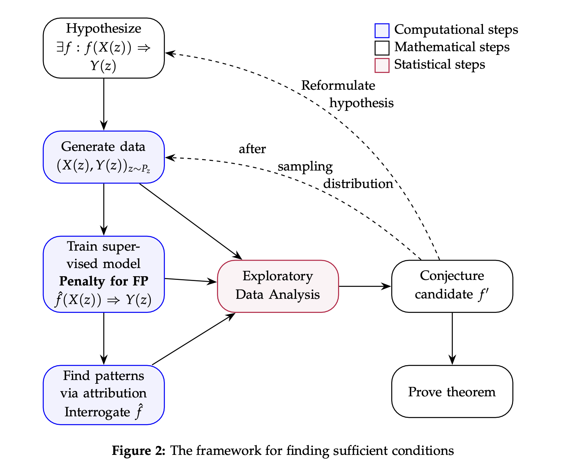

# How to Use Deep Learning to Identify Sufficient Conditions
## A Case Study on Stanley’s e-Positivity
Farid Aliniaeifard (farid@sdu.edu.cn) and Shu Xiao Li (lishuxiao@sdu.edu.cn)

**Abstract.** In a study, published in Nature, researchers from DeepMind and mathematicians demonstrated a general framework using machine learning to make conjectures in pure mathematics. Their work uses neural networks and attribution techniques to guide human intuition towards making provable conjectures. Here, we build upon this framework to develop a method for identifying sufficient conditions that imply a given mathematical statement. Our approach trains neural networks with a custom loss function that prioritizes high precision. Then uses attribution techniques and exploratory data analysis to make conjectures. As a demonstration, we apply this process to Stanley’s problem of e-positivity of graphs–a problem that has been at the center of algebraic combinatorics for the past three decades. Guided by AI, we rediscover that one sufficient condition for a graph to be e-positive is that it is co-triangle-free, and that the number of claws is the most important factor for e-positivity. Based on the most important factors in Saliency Map analysis of neural networks, we suggest that the classification of e-positive graphs is more related to continuous graph invariants rather than the discrete ones. Furthermore, using neural networks and exploratory data analysis, we show that the claw-free and claw-contractible-free graphs with 10 or 11 vertices are e-positive, resolving a conjecture by Dahlberg, Foley, and van Willigenburg.

